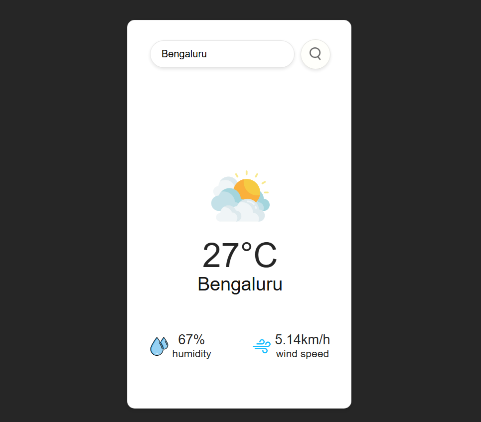

# 🌦️ Weather App

A simple Weather App built with HTML, CSS, and JavaScript that shows real-time weather information using the OpenWeatherMap API.

### [🌐 View Live Demo](https://webbyhosna.github.io/weather-app/)

### 🚀 Features

- 🌍 Search weather by city name
- 🌡️ Shows temperature, humidity, and wind speed
- 🖼️ Dynamic weather icons (Clear, Clouds, Rain, Snow, Mist, etc.)
- ⚠️ Error handling with custom undefined icon when city not found
- 📱 Responsive and clean UI design
  
👉 By default, it shows Dhaka weather. Search any other city to update data.


  
### 🛠️ Technologies Used

- HTML5 – Structure
- CSS3 – Styling
- JavaScript (ES6) – Functionality
- OpenWeatherMap API – Weather Data

  
### 📂 Project Structure

```text
weather-app/
│
├── index.html
├── style.css
├── script.js
└── assets/
    ├── clear.png
    ├── clouds.png
    ├── drizzle.png
    ├── haze.png
    ├── mist.png
    ├── rain.png
    ├── snow.png
    ├── humidity.png
    ├── wind.png
    └── undefined.png
```

### ✨ Future Improvements

- Add 5-day forecast
- Detect current location weather using Geolocation API
- Improve UI with animations

### 👩‍💻 Author
This project is developed by [Asma Ul Hosna](https://www.linkedin.com/in/asma-ul-hosna-4a6193367/) 
